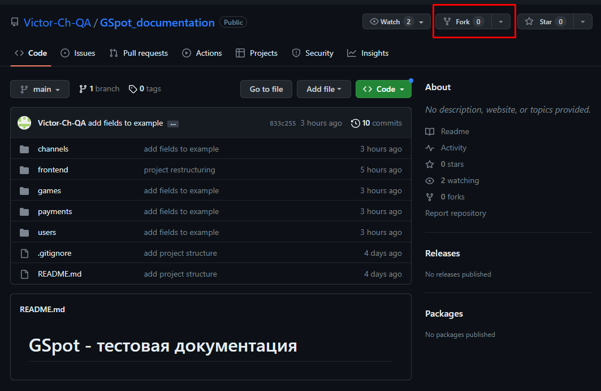

# GSpot - тестовая документация

Инструкция

1. Сделать Fork в свой репозиторий 

Скриншот

2. Внести правки в файл/файлы
3. Отправить Pull request в основной репозиторий (с которого сделан Fork)
4. Изменения будут внесены после их одобрения владельцем основного репозитория.

Структура документации:
* frontend - тестовая документация, относящаяся к frontend
* users, games, payments, channels - тестовая документация backend сервисов
    - структура директрия внутри сервиса повторяет структуру api запросов
    - метод пишется в названии файла в конце (get, post, delete и т.д.)
    - games/community/community_comments_review_id_get.md - тест-кейс, для проверки метода get. 
* src - для изображений и прочего

|**swagger**|**github**|
| :-: | :-: |
|[Fork](src/img/swagger - path.jpg)|github - path.jpg|